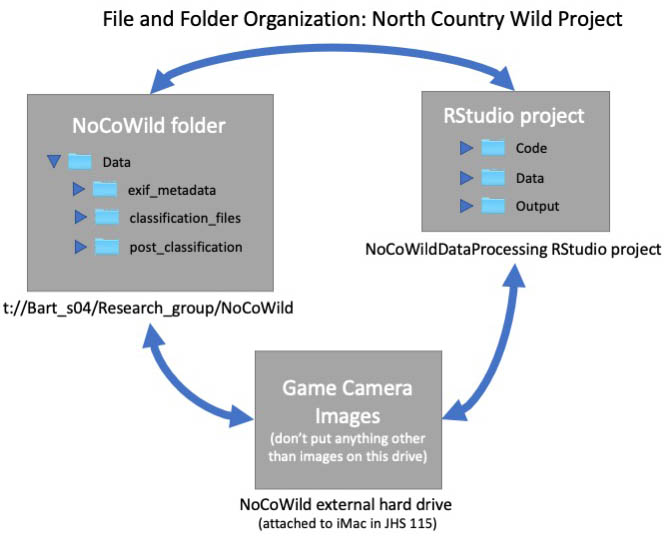

# (PART) Part I - Project Overview {-}
# Process Overview {#overview}

There are many steps required to properly process our game camera images. A workflow diagram (Figure \@ref(fig:fig1-1)) highlights the 9 steps that are required.

```{r, fig1-1, echo = FALSE, fig.cap = 'Steps involved in preparing images for upload to Zooniverse'}
knitr::include_graphics("images/fig1.1.overall_workflow_diagram.jpg")
```


## Datasheet, File and Folder Locations {#data-management}
### File and folder locations
With camera traps, it is possible to generate a LOT of data, very quickly. Processing those data requires a lot of R files, as well. It is very easy to accidentally overwrite files or save things on e.g. your P:/ drive or your personal computer, making it very difficult for code to run well in the future (when the next student cannot access your files). For that reason, we have taken care to organize our files very carefully. *Please pay attention to the organization as described below and to apply it as you work on this project.*

We work on this project from three file locations (Figure \@ref(fig:fig1-2)):


1. The NoCoWild folder on the t:// drive
    - t://Bart_s04/Research_group/NoCoWild

2.  [A shared RStudio project on github](https://github.com/erethizon/NoCoWildDataProcessing)

3.  An external hard drive attached to the iMac in JHS 115


```{r, fig1-2,echo = FALSE, fig.cap = 'File and folder organization for the North Country Wild Project'}
#add figure 2 and a text reference as its caption
 #figure
```

### Data sheets

Blank copies of the paper data sheets we take into the field to record individual camera deployments can be found in the lab. In case you need to print more, the file is called *Camera deployment sheet* and there
is a word copy as well as a pdf copy in the *Datasheets* folder in the *t:drive NoCoWild folder*.

### Images

Our game camera images take up a ton of hard drive space, so we keep them on an external hard drive attached to the iMac in the lab (Figure \@ref(fig:fig1-2)). That hard drive should **never**[^1], ever leave the lab!!! 

In the unusual circumstance in which you can't work directly in the lab (thanks, COVID-19!) we have a second, back up hard drive for loan.

The name of the main image hard drive is "NoCoWild". It contains
images other than our game camera projects, as well. You may add images to this hard drive, but please don't delete images unless Erika is sitting next to you, saying "yes, it is ok to delete that" so that it can be her fault if something goes horribly wrong.

### Data files

We keep data files in two locations. Exif metadata files about sets of images (see below for explanation) as well as unmodified classification or other files from the Zooniverse platform are stored on the t:drive in the Data folder.

The RStudio project is where we store some data products (after
processing in R) and where we store all of the code we use for image processing and analysis. Depending on what stage of the project you are in, files may be found in the "Code", "Data" or "Output" folders.

See Organization of our project in RStudio below for details.

[^1]: I mean NEVER, EVER, EVER. Got it?


