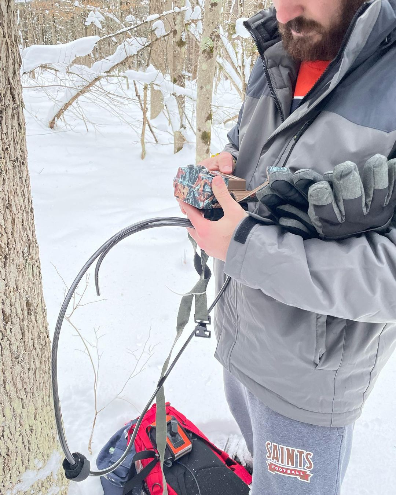

# Retrieve SD Cards from Cameras {#get-sd-cards}

To retrieve the SD cards means you need to visit the cameras in the field. Those trips entail either collecting the SD card and the camera, or visiting the camera to put in fresh batteries and a fresh SD card (figure \@ref(fig:fig2-1)).

```{r, fig2-1,echo = FALSE, fig.height = 3, fig.align = 'center', fig.cap = 'Peyton Schmitt (2023) deploying a camera'}
 #figure
```


Typically, when you pick up a camera, you will bring the data sheet into the field that was filed out when each camera was first deployed and will record the date upon which the camera was "retrieved" as well as fill in some information about battery charge at retrieval, whether the camera was working at retrieval, and step through a check-list of "to-dos" when you are in the field. 

Alternatively, if you are just swapping batteries and swapping in a new SD card but leaving the camera in place, you will bring the old data sheet, record the date on which the SD card was retrieved, and fill out a new data sheet about the date on which the new SD card was placed.

Regardless, **it is critical** that you keep track of which SD card comes from which camera and the site name (this information **must** be recorded on your data sheet![^1]. You should have a paper data sheet on which you record this information. Keep the SD cards clean and dry.

When you return to the lab, you will use the card reader attached to the iMac to upload the images.


[^1]: CRITICAL!
