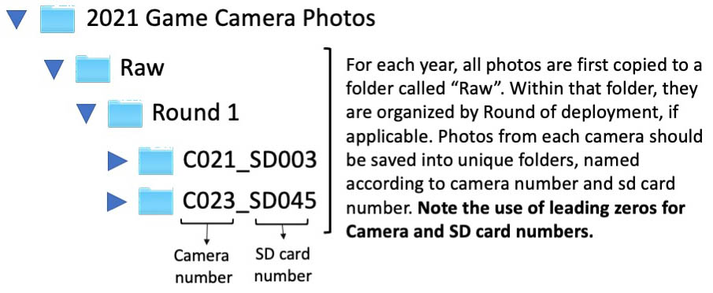

# Organize images on the external hard drive


Back in the lab, download all of the photos from each SD card onto the external hard drive called "NoCoWild". Use the iMac which has a built in SD card reader on the back R side of the monitor.

There are two main steps to organizing the photos:

1. Archiving the files

2. Copying and renaming the files

## Step 1: Archiving the files

On the external hard drive, we keep a set of original images that we **never**[^2] modify. We organize files by calendar year. Depending on the year, the folder names may be different than what you see below and we may use a slightly different folder and file naming convention, though the basic steps are similar to what you see here.

(ref:figure1) A flow diagram for how we name files and folders.

```{r, echo = FALSE, figure1, fig.cap = '(ref:figure1)'}
#add figure 1 and a text reference as its caption
 #figure

```

Be sure to check with Erika to make sure you know what file and image naming conventions are currently in use**.

Original files (if this is the first time they are downloaded from the SD card) go into the folder called "2021 Game Camera Photos" (or the appropriate folder for the particular year). Within that folder, they are placed into a subfolder called "Raw", and within that folder, into subfolders by Round. Within the folder for each round will be a single folder named for each game camera & SD card combination (Figure 2.1). You
may need to create these folders when you first upload the data. Please use leading zeros and make sure every camera number is recorded as 3 digits and every sd card number is recorded as three digits. For example, for images from Camera 24 SD card 5, you would have:

> C024_SD005

{width="5.256606517935258in"
height="2.1582425634295714in"}

[]{#_Ref71036432 .anchor}Figure 3. File structure and folder naming
conventions for archiving game camera photos.

In some years, we also incorporated a site name into the file structure,
so that folders for each camera are included in a folder for each site.

{width="0.2463746719160105in" height="0.22in"}

**Again, these files are the originals and should NEVER BE ALTERED.**

## Step 2. Copying and renaming the files

Once we have all of the photos archived in the \"Raw\" folder, we copy
them to another folder called \"Processed\" and rename each image file
according to its camera number and SD card (and in some cases Round
and/or Site). It is easiest to do this on the iMac.

-   First, copy the \"Raw\" folder and paste it inside of the \"2021
    Game Camera Photos\" folder (or similar).

-   Rename the copied folder \"Processed\"

> Your task will be to replace the "IMG" or "EK" string in each image
> file name (which string will depend on the camera model from which the
> pictures were made) with a special string containing some combination
> of camera, SD card, Round, and possibly site. All of the pictures in
> the single folder will receive the same code, because they come from
> the same Camera and SD card combination. The flow chart for
> determining the proper code is as follows (Figure 4):

{width="5.9672134733158355in"
height="3.6434426946631673in"}

[]{#_Ref71036682 .anchor}Figure 4. Image naming conventions depending on
camera number, SD card number, and possibly deployment round and site.

Once you have your folder pasted into the \"Processed\" folder, follow
these steps to rename the files:

1.  Double click on the folder containing the photos (Figure 5). You
    will see that the default file names are assigned by the camera and
    are totally boring and easily confused with other image files.

{width="4.435714129483815in"
height="2.5396347331583553in"}

[]{#_Ref71037090 .anchor}Figure 5. File folder open showing original
file names.

2.  Now select all of the images in the folder. The fastest way is to
    use z-A.

3.  With all of the images selected, right-click the mouse and choose
    "Rename X items" where X is the number of selected files (Figure 6).

{width="1.5416666666666667in"
height="2.695181539807524in"}

[]{#_Ref71037121 .anchor}Figure 6. When you right-click the image files
you have selected, choose "Rename" to batch rename the files.

4.  A new dialog box will open (Figure 7).

In this example, the images all came from a forest called Beaver Creek,
so I will enter "IMG" in the "Find" box and "BC" in the "Replace with"
box, as in Figure 7.

-   Depending on what combination of camera, sd card, round and site you
    may be dealing with, you can replace the \"IMG\" with a full string
    indicating all of the information that needs to be changes. For
    example, instead of just replacing \"IMG\" with \"BC\" as in the
    example, you could replace it with something like
    \"C024_SD002_R1\_\".

> {width="3.7754647856517933in"
> height="0.9979166666666667in"}

[]{#_Ref71037140 .anchor}Figure 7. Find the "IMG" part of each filename
and replace it with "BC" (or other appropriate round or site codes).

> Click the "Rename" button and the files will be renamed (Figure 8).
>
> {width="4.228571741032371in"
> height="1.2735411198600175in"}

[]{#_Ref71037198 .anchor}Figure 8. You can see that all of the files
have been renamed -- the "IMG" was replaced by "BC" for each image.

5.  If you forget to add an element to a text name, (e.g. you forget to
    put the round number), you can use the \"Add text\" feature to do
    so. While all the files are still selected, right-click again and
    choose to rename the items again (i.e. repeat Step 3 above). This
    time, choose the dropdown arrow next to "Replace Text" and select
    "Add text". Then choose the dropdown arrows next to "after name" and
    select "before name".

When you are finished, you should see that your folder includes a set of
renamed image files, like Figure 9:

{width="5.341666666666667in"
height="1.9420614610673665in"}

[]{#_Ref71037215 .anchor}Figure 9. Appearance of files once correctly
renamed.

Repeat these steps to save and rename any folders of images you import
to the Processed folder on the hard drive.

## Summary

At the end of the Photo Organization step, you will have a set of
subfolders containing original, unmodified image files in the Raw folder
and a second set of subfolders in the Processed folder containing the
modified images (Figure 10)

{width="3.3278685476815397in"
height="2.89161854768154in"}

[]{#_Ref71038277 .anchor}Figure 10. Summary view of Raw and Processed
folder organization on the external hard drive.