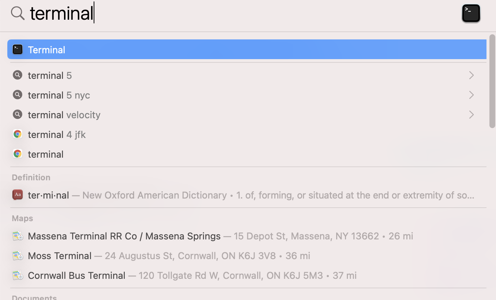

# Using the "terminal" (command line interface) on a mac {#using-terminal}

## Introduction {#intro-terminal}
Now that we have our images collected from the field, it is time to prepare them for upload to the zooniverse platform for the species identification step. Game cameras collect a LOT of images, and we need to basically "curate" these images so that they are easy to keep track of.  The steps involve:

1. Copying the images from the SD card into a "Raw" folder on the hard drive
2. Copying, renaming, and resizing the images and placing them in a "Processed" folder on the hard drive.
3. Generating a metadata file about the processed images

In the past, each of these steps involved a lot of pointing and clicking and had lots of opportunity for user error. Since then, lab alumn Brett Ford has written a series of Python scripts that automate these tasks and reduce the potential for error.

To run the python scripts, you will need to use the computer's command-line interface, also known as the "terminal" or "bash." The rest of this chapter helps you learn how to navigate around the terminal on a mac.

## Accessing the terminal {#access-terminal}

To access the terminal on a mac,  go to the search bar (the tool that looks like a magnifying glass) in the upper right of the screen and search "terminal" (figure \@ref(fig:fig3-1)). Once you see the terminal icon, click on it to open the terminal interface.


```{r, fig3-1,echo = FALSE, fig.height = 3, fig.align = 'center', fig.cap = 'Using spotlight search on a mac to open the terminal '}
 
```


\ 
\ 


Table 3.1 shows a list of some of the common command-line functions.

  -----------------------------------------------------------------------
  Command        Purpose
  -------------- --------------------------------------------------------
  cd directory   changes path from working directory to named directory
                 where "directory" is the name of the directory you
                 wish to navigate to.

  cd ..          changes your directory to the parent directory from the
                 one you are currently in (note the space before the ..)

  ls             lists all visible files in your directory

  pwd            lists path of your current directory ("print working
                 directory")

  . vs ..        "." Specifies the directory you are currently in,
                 whereas ".." specifies the parent directory
  -----------------------------------------------------------------------

The terminal window presents a way to move around directories (folders)
on your computer, run software, and execute other commands without using
the "graphical user interface", or "GUI" that you are most familiar with
(the Menu-driven system where you click with your mouse to make things
happen). There are several different ways in which we must use the
terminal for image processing.

## Note about directory names {#directory-names}

The command-line has trouble understanding folder names if there is a
space in the folder name. For example, if I have a folder called `Card 4`, I specify it by writing `Card\ 4`

The `\` tells the computer that the name is continuing. The space
followed by the 4 tells it that these are the remaining parts of the
directory name.

Avoid problems with the terminal by using `\` or not otherwise including spaces in filenames.

Also, this guide is written assuming you are using the iMac in the
Barthelmess research lab. If you are trying to use these commands on
another mac, there may be slight differences. If you are trying to use
these commands on a PC, you will find that the PC operating system uses
different characters to indicate a file path. Thus, this code will get
you on the right path on a PC, but will not be sufficient as is.

A neat trick for changing the directory folder path is to drop the folder icon (not from the terminal) onto the `\$` prompt inside of the terminal. The terminal
will then indicate the full path to that directory. Try this:

`cd [drop folder with files here after you type cd]`

Terminal will change the working directory to the correct file path!

## Summary {#ch3-summary}
The "terminal" interface is one of the main ways we will run the tools we need for managing our images. You should become comfortable working with the terminal in order to proceed with the next chapters.
