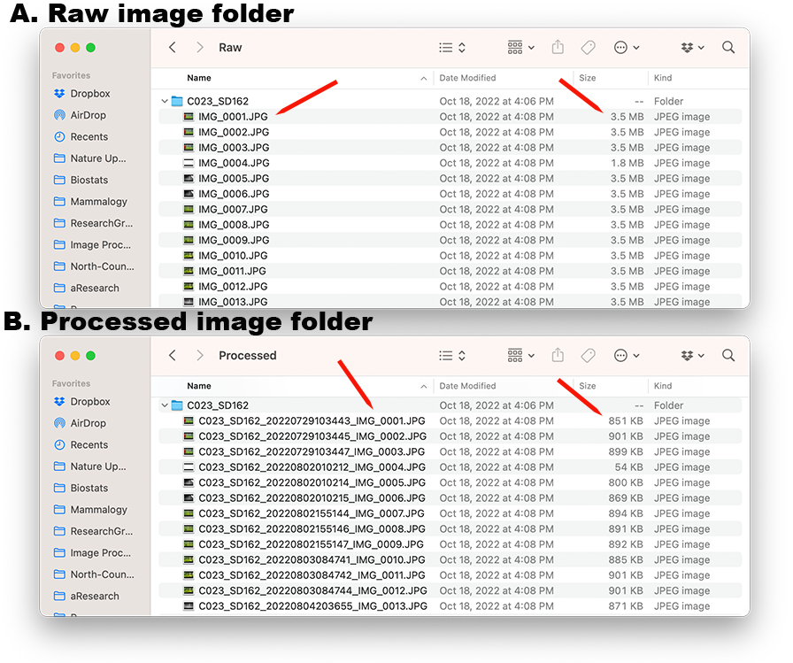

# Hard Drive Organization  {#hard-drive-org}

## Introduction {#hard-drive-intro}
As you saw in [Chapter 1](#Ch1-overview) in the Process Overview diagram,once we have collected the SD cards from the field, we have a lot of image processing to do. 

There are two main steps to organizing the photos:

1. Archive the files in the *Raw* folder

2. Copy, rename, add copyright info, resize images and store in  the *Processed* folder


Because there are a lot of steps, there are also many opportunities to introduce error. One way we can reduce the likelihood of error is by automating much of the process.

To understand how the processing will work, you first need to understand how we organize our files on the external hard drive.

## Hard Drive Organization {#hard-drive-organization}

When you click on the NoCoWild hard drive icon, you will see something that looks more-or-less like figure \@ref(fig:fig4-1).  We create a new folder for each academic year (so, for example, 2022_Game_Camera_Photos has images from the 2022-2023 academic year). 

```{r, fig4-1,echo = FALSE, fig.height = 3, fig.align = 'center', fig.cap = 'Higher level view of the NoCoWild hard drive organization'}
knitr::include_graphics("images/Chapter-4/fig4.1.noco_wild_drive_organization.png") 
```
\

Within any particular year's folder, we create a "Raw" folder and a "Processed" folder, and within each of those we create a folder for each Camera-SD card combination (figure \@ref(fig:fig4-2)). Sometimes you will also see an extra folder or file within the Processed folder that are by-products of uploading images to the Zooniverese platform. For example, in figure \@ref(fig:fig4-2), you see a folder called "21-Oct-Upload" and a file called "exif_2022_...upload.csv".

```{r, fig4-2,echo = FALSE, fig.height = 3, fig.align = 'center', fig.cap = 'Processed and Raw folders with subfolders for each camera + sd card combination'}
knitr::include_graphics("images/Chapter-4/fig4.2.processed_and_raw_folders.png") 
```
\
 
 
Figure \@ref(fig:fig4-3) compares the Raw and Processed image folders for Camera-SD card C023_SD162.  Notice in **A** that the folder just contains the original, raw images, named with whatever names were assigned by the game camera and at the size that was captured by the game camera.  Contrast that with **B** and see that in the Processed folder for this same camera, the images have all been renamed to include the camera-sd card and date that the picture was taken. The images have also been resized to be smaller than 1MB for upload to Zooniverse.

```{r, fig4-3,echo = FALSE, fig.height = 3, fig.align = 'center', fig.cap = 'Comparison of the Raw and Processed images for Camera-SD card C023_SD162'}
 
```


## Summary {#hard-drive-summary}
The "terminal" interface is one of the main ways we will run the tools we need for managing our images. You should become comfortable working with the terminal in order to proceed with the next chapters.
