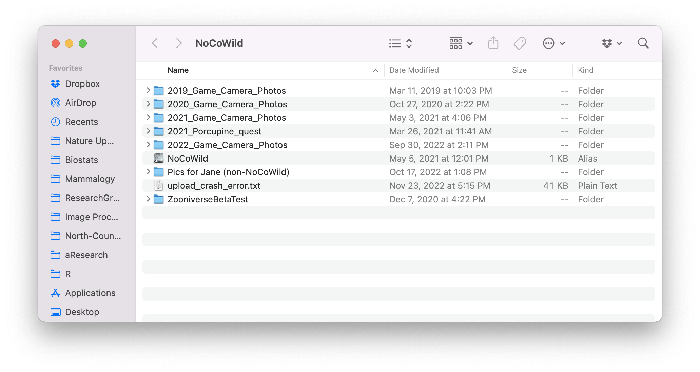
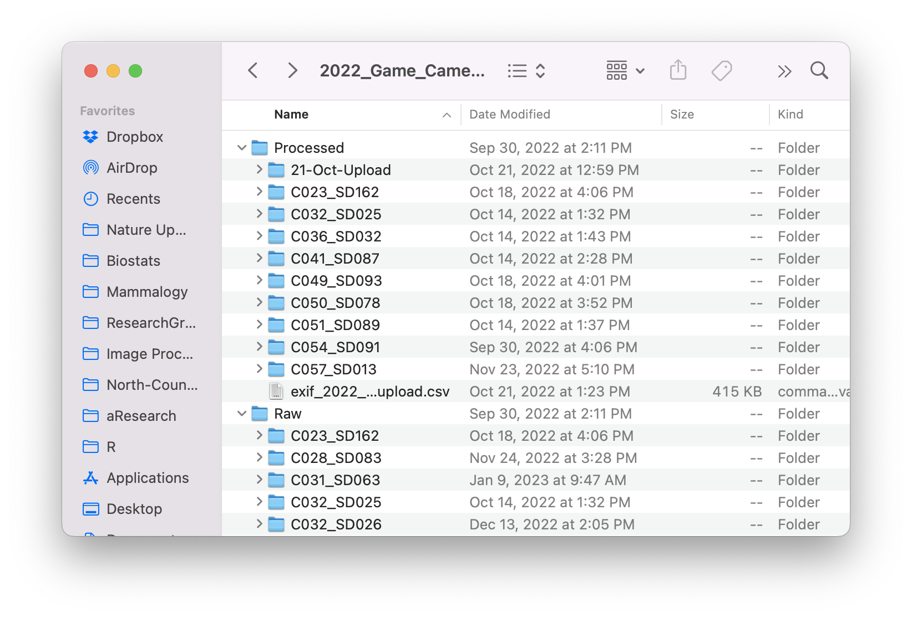

# Introduction to Scripting {#using-scripting}

## Introduction {#scripting-intro}
As you saw in [Chapter 1](#Ch1-overview) in the Process Overview diagram,once we have collected the SD cards from the field, we have a lot of image processing to do.

To understand how the processing will work, you first need to understand how we organize our files on the external hard drive.

There are two main steps to organizing the photos:

1. Archive the files in the *Raw* folder

2. Copy, rename, add copyright info, resize images and store in  the *Processed* folder

Before we can attemtpt these steps, we need to understand how we organize our image files on the hard drive.

## Hard Drive Organization {#hard-drive-organization}

When you click on the NoCoWild hard drive icon, you will see something that looks more-or-less like figure \@ref(fig:fig4-1).  We create a new folder for each academic year (so, for example, 2022_Game_Camera_Photos has images from the 2022-2023 acadmic year).

```{r, fig4-1,echo = FALSE, fig.height = 3, fig.align = 'center', fig.cap = 'Higher level view of the NoCoWild hard drive organization'}
 
```

Within any particular year's folder, we create a "Raw" folder and a "Processed" folder, and within each of those we create a folder for each Camera-SD card combination (figure \@ref(fig:fig4-2)). Sometimes you will also see an extra folder or file within the Processed folder that are by-products of uploading images to the Zooniverese platform. For example, in figure \@ref(fig:fig4-2), you see a folder called "21-Oct-Upload" and a file called "exif_2022_...upload.csv".

```{r, fig4-2,echo = FALSE, fig.height = 3, fig.align = 'center', fig.cap = 'Processed and Raw folders with subfolders for each camera + sd card combination'}
 
```
### Raw Folder Organization {#raw-folder-org}

### Processed Folder Organization {#processed-folder-org}

## Summary
The "terminal" interface is one of the main ways we will run the tools we need for managing our images. You should become comfortable working with the terminal in order to proceed with the next chapters.
