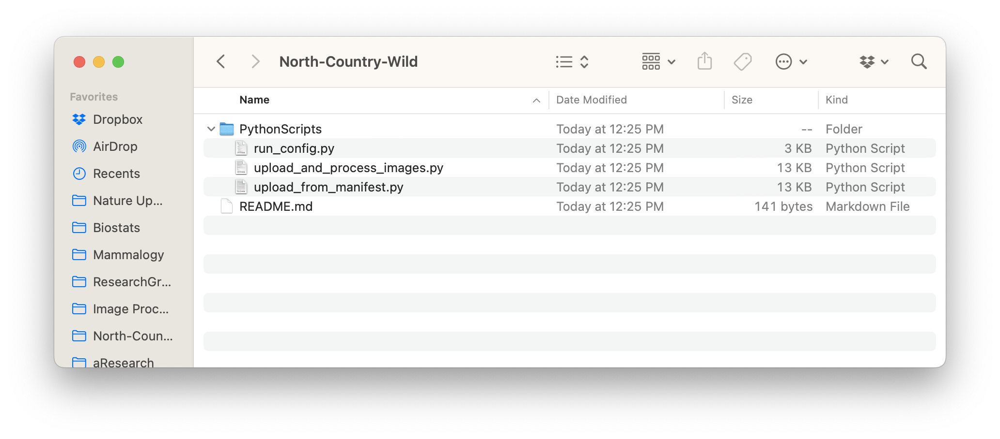
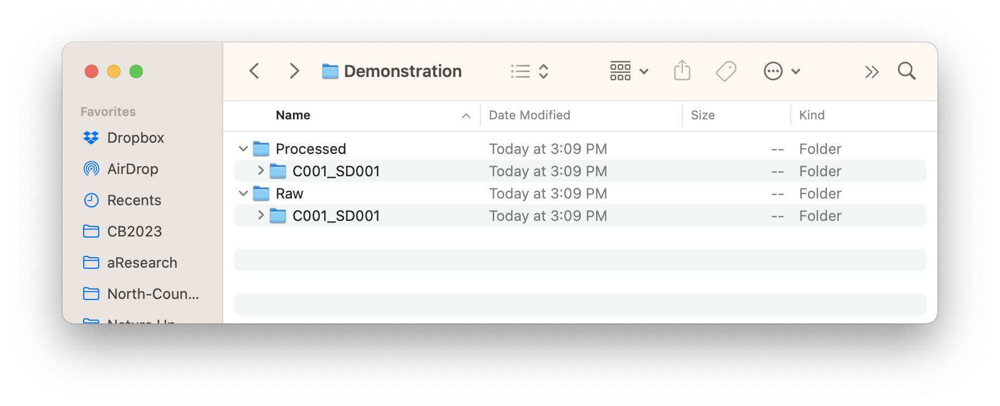
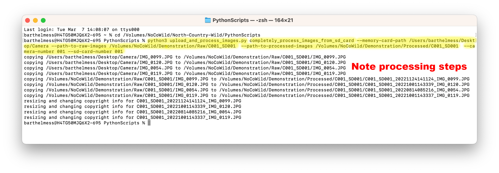
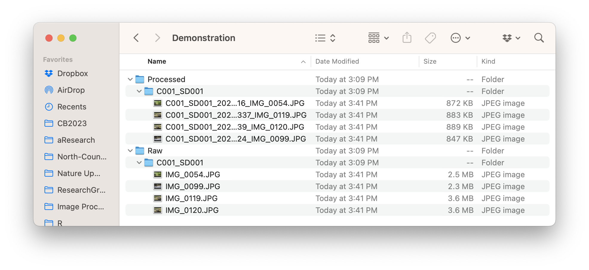

```{r, echo = FALSE}
#set things up
library(here)
```

# Introduction to scripting {#using-scripting}

## Introduction {#scripting-intro}

Now that you understand how we organize our files, it is time to learn how to use our python scripts to automate the image processing steps. **For many people, this will be the most confusing part of the process, so please read the instructions carefully.**

## Python Scripts {#python-scripts-overview}

Notice the expanded folder called `North-Country-Wild` in figure \@ref(fig:fig5-1). It contains the `PythonScripts` folder that you will need to access to run our scripts.

Brett has created a python script called `upload_and_process_images.py` located in the folder called `PythonScripts` inside of th `North-Country-Wild` folder in the root directory of the NoCoWild hard drive (figure \@ref(fig:fig5-1)). The other two scripts in the folder are used for pushing files to the zooniverse once they are processed.

```{r, fig5-1,echo = FALSE, fig.height = 3, fig.align = 'center', fig.cap = 'Python Script files inside of the PythonScripts folder'}
 
```

\
To use the script you will need to:{#use-scripts}

-   Open a terminal window (See ["Accessing the terminal" in Chapter 3](#access-terminal) for a refresher).
-   From the terminal, cd into the PythonScripts folder by typing `cd` on the command line and then dragging the folder icon onto the terminal. Hit return when finished.
-   To access the script and learn about its subcommands, type `python3 upload_and_process_images.py -h`. Text with information about the script subcommands will display in the terminal window because you added `-h` after the name of the script (figure \@ref(fig:fig5-2)).

```{r, fig5-2,echo = FALSE, fig.height = 4, fig.align = 'center', fig.cap = 'Terminal window showing location in PythonScripts folder and subcommands for the upload_and_process_images.py script'}
knitr::include_graphics("images/Chapter-5/fig5.2.terminal_showing_script_commands.png") 
```

## Script subcommands {#script-subcommands}

You can see that there are three possible subcommands, each of which take several different arguments (Table \@ref(tab:table5-1)).

```{r, table5-1, echo = FALSE, warning=FALSE}
table5_1 <-read.csv(here("Data", "python_subcommands.csv"))
knitr::kable(
  table5_1, booktabs = TRUE,
  caption = "List of python script subcommands and their arguments"
)
```

\

Further, most of these subcommands take arguments, which are typed into the terminal as `--argument-name` followed the required information. For example, Table \@ref(tab:table5-2) shows the arguments that are required by the `completely_process_images_from_sd_card` subcommand.

\

```{r, table5-2, echo = FALSE, warning=FALSE}
table5_2 <-read.csv(here("Data", "completely_process_subcommands.csv"))
knitr::kable(
  table5_2, booktabs = TRUE,
  caption = "List of arguments required by the completely_process_images_from_sd_card subcommand"
)
```

## Running the Scripts {#running-scripts}

Before you can begin using the scripts to process image files, you need to create empty folders for the camera-sd card combination in the Raw and Processed folders for the given year as shown in Chapter 4 [Section 4.2 Hard Drive Organization](#hard-drive-organization). Please be careful in naming these folders so that the folder names are of the form `C***_SD***` where \*\*\* represents the 3-digit camera number (including a leading zero) and the 3-digit SD card number (including a leading zero), respectively.

### Completely process images from sd card {#complete-process}

Most often, you will want to completely process all of the images on an SD card. As a reminder, in this process, running the python script correctly will:

-   Copy all of the images from the SD card to the correctly labeled folder in the `Raw` image directory

-   Copy all of the images from the `Raw` folder to the correct directory in the `Processed` folder

-   Rename all of the images in the correct `Processed` folder so that the image name includes the camera-sd card as well as the time stamp the image was made, in addition to the original image name

-   Resize the all of the images to just under 1MB in size for later upload to the zooniverse

-   Add a copyright field with the words "Barthelmess Lab and Nature Up North" to all of the image exif data.

\

Let's assume for demonstration purposes that I have a number of images on an SD card in a folder called `Camera` and let's further assume that the SD card was number 001 and the camera was number 001. I therefore have created a folder called `C001_SD001` in both the `Raw` and `Processed` folders on the hard drive. Notice what they look like prior to processing the scripts in Figure \@ref(fig:fig5-3).

```{r, fig5-3,echo = FALSE, fig.height = 4, fig.align = 'center', fig.cap = 'Raw and Processed folders for a demonstration set of images prior to image processing'}
 
```

\
**Specific instructions:**

1.  Obtain a paper copy of the data sheet associated with the specific deployment you intend to process and note the Camera number and SD card number.

2.  Open the correct year's folder on the `NoCoWild` hard drive. Create a new, empty folder named [as indicated above](#running-scripts) in the `Raw` folder and in the `Processed` folder.

3.  Place the SD card into the card reader attached to the imac.

4.  [Open a terminal session](#access-terminal) and `cd` to the `PythonScripts` folder (inside of the `North-Country-Wild folder on the`NoCoWild\` hard drive). [Refresh your memory about how here](#use-scripts)

5.  Paste the following line of code at the cursor `python3 upload_and_process_images.py completely_process_images_from_sd_card` **Do not press return after pasting**

6.  Paste the following line of code at the cursor `--memory-card-path` followed by a space and then drag the folder of images on the SD card onto the terminal **Do not press return after pasting**

7.  Paste the following line of code at the cursor `--path-to-raw-images` followed by a space and then drag the appropriate Raw image folder onto the terminal. **Do not press return after pasting**

8.  Paste the following line of code at the cursor `--path-to-processed-images` followed by a space and then drag the appropriate Processed image folder onto the terminal. **Do not press return after pasting**

9.  Paste the following line of code at the cursor `--camera-number` followed by a space and then type the 3-digit camera number including a leading zero **Do not press return after pasting**

10. Paste the following line of code at the cursor `--sd-card-number` followed by a space and then type the 3-digit number for the SD card including a leading zero

11. Hit `Return`. If you have no typos or other errors, the script will immediately begin processing the images.

Figure \@ref(fig:fig5-4) shows the terminal window for steps 5-11 above. The terminal commands are highlighted in yellow.

```{r, fig5-4,echo = FALSE, fig.height = 4, fig.align = 'center', fig.cap = 'Terminal window showing a complete script for processing images from a SD card. The terminal commands are highlighted in yellow and the output, showing that the script ran, follows below the terminal commands.'}
 
```

\
After the script ran, the resulting contents of the `Raw` and `Processed` image folders for this demonstration is shown in Figure \@ref(fig:fig5-5).

```{r, fig5-5,echo = FALSE, fig.height = 4, fig.align = 'center', fig.cap = 'The same Raw and Processed folders for a demonstration set of images after image processing'}
 
```

### Running other subcommands {#other-subcommands}

The process for running the other two subcommands, `copy_raw_images_change_file_size_and_copyright` and `change_file_size_and_copyright` is very similar. You will need to specify file paths and other arguments. But the overall process of running the scripts is the same:

1.  `python3 upload_and_process_images.py` followed by
2.  the appropriate subcommand, followed by
3.  each argument for the subcommand, with "answers" (e.g. file path, camera or sd card number) specified

Remember, you can use the `-h` argument after a subcommand to open the help information in your terminal window to learn how to specify the arguments that go with a particular subcommand.

## Summary

Managing game camera images is a complex process. Images have to be associated with specific cameras and SD cards, have to be transferred to new folders, and have to be resized and renamed. Though the steps in this chapter may seem complex, imagine if you had to go through each of these steps for every individual image! There would be so many opportunities to introduce error. Instead, we are using a series of python scripts to streamline the process and reduce the propegation of errors in the data set.
