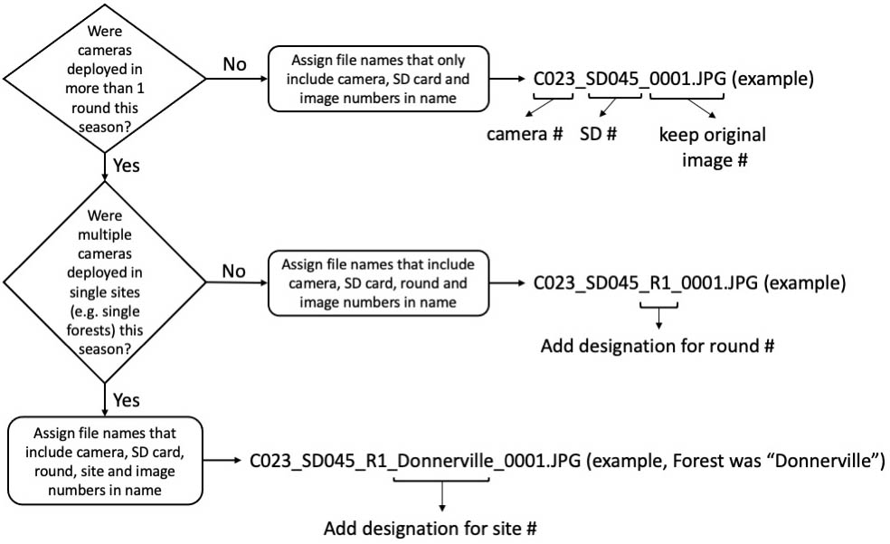
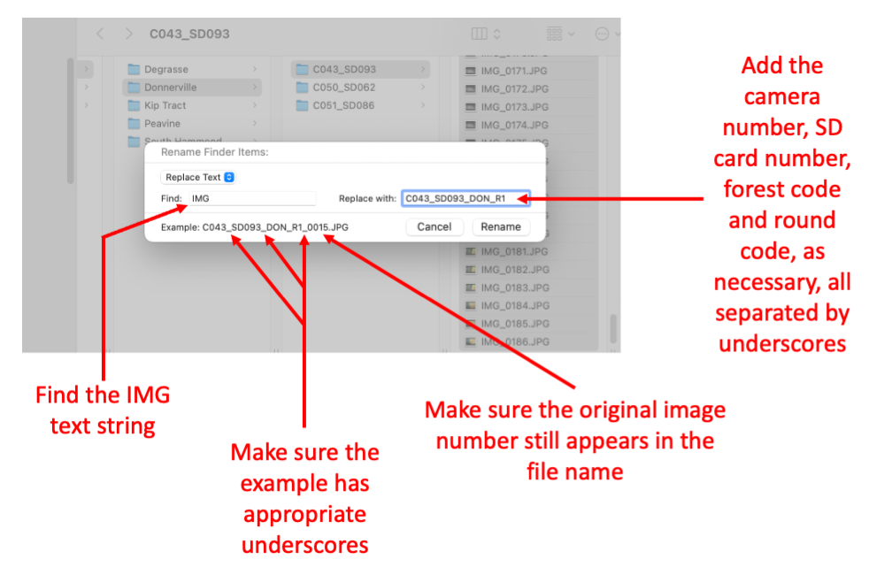
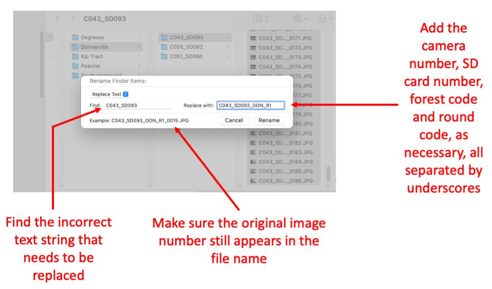

# Organize images on the external hard drive

Back in the lab, download all of the photos from each SD card onto the external hard drive called "NoCoWild". Use the iMac which has a built in SD card reader on the back side of the monitor.

There are two main steps to organizing the photos:

1. Archiving the files in the *Raw* folder

2. Copying and renaming the files in the *Processed* folder
    - Creating the Processed folder
    - Renaming image files within subfolders of the Processed folder

## Step 1: Archiving the files

On the external hard drive (called "NoCoWild"), we create a folder called *Raw* within which we keep a set of original images that we **never**[^1] modify. Every set of images from a single SD card in a single camera will be collected together into a unique folder. We organize folders by calendar year, and usually also by round number (a round is a single phase of camera deployments) as well as camera location (e.g. forest name). An example is shown in figure 3.1. Depending on the year, the folder names may be slightly different than what you see in fig. 3.1 due to differences in study design in a particular year. 

**Be sure to check with Erika to make sure you know what file and image naming conventions are currently in use**.

(ref:fig3-1) Organization of the "Raw" folder containing the original, unmodified images files.

```{r, echo = FALSE, fig3-1, fig.cap = '(ref:fig3-1)'}
#add figure 1 and a text reference as its caption
knitr::include_graphics("images/fig3.1.Raw files organization.jpg") #figure
```

Within the folder for a given year, we create the folder called *Raw*. Then within the *Raw* folder we create, as needed, a folder for each site, and within the folder for each site, a folder for each round (if needed). We do not make specific site folders unless we have multiple cameras deployed at the same site at the same time. Then we create the lowest-level folders, single folders for each game camera & SD card combination (Figure 3.1). 

You may need to create these folders when you first upload the data. Please use leading zeros and make sure every camera number is recorded as 3 digits and every SD card number is recorded as three digits. For example, for images from Camera 24 SD card 5, you would have C024_SD005.


**As a reminder, all photos inside the *Raw* folder are the originals and should NEVER BE ALTERED[^2].**

## Step 2. Copying and renaming the files

There is a great deal of processing we need to do in order to prepare our images for upload to the [Zooniverse](https://www.zooniverse.org). For example, every game camera will name all of the images in the same way, so it is possible to have multiple images named, for instance, "IMG_0001.jpg". We will thus rename all images so that each image name reflects the camera, SD card, round and site information that is associated with each image. 

To do so, once we have all of the photos archived in the "Raw" folder, we copy them to another folder called "Processed" and then rename each image file according to its camera and SD card number and, in some cases, round and/or site. An example of the final product is shown in figure 3.2. It is easiest to complete these steps on the iMac in the lab.

(ref:fig3-2) "Raw" and "Processed" folders and example file names within each.

```{r, echo = FALSE, fig3-2, fig.cap = '(ref:fig3-2)'}
#add figure 2 and a text reference as its caption
knitr::include_graphics("images/fig3.2.raw_and_processed_files.jpg") #figure
```
### Create the Processed folder
To create the Processed folder, first copy the "Raw" folder by right-clicking on the folder name and choosing "Copy." Next, paste it inside of the "2021 Game Camera Photos" folder (or similar) by right-clicking inside of the destination folder and choosing "Paste Item." Now rename the folder you just pasted by right-clicking on the folder, choosing "Rename" and then changing the name to "Processed".

### Rename image files within each subfolder
Now that we have the Processed folder, along with all of its subfolders, we can undertake the process of renaming image files. Note that, depending on what other members of the lab have already done, you may only do this step for a single folder of images, or you may do this step for several folders of images. In either case, you will work on one folder of images at a time, repeating the following steps for each folder as you work.

We rename each image file so that the image name is a string of characters containing some combination of camera, SD card, Round, and possibly site. All of the pictures in the single folder will receive the same code, because they come from the same Camera and SD card combination. The flow chart for determining the proper code is as shown in Figure 3.3.

(ref:fig3-3) Image naming conventions depending on camera number, SD card number, and possibly deployment round and site.

```{r, echo = FALSE, fig3-3, fig.cap = '(ref:fig3-3)'}
#add figure 3 and a text reference as its caption

#figure 3

```


Once you have your folder pasted into the "Processed" folder and appropriately renamed, follow these steps to rename the files:

1. Double click on the folder containing the photos you wish to rename.
    - You will see that the default file names are assigned by the camera, are totally boring, and could be easily confused with other image files from another camera (figure 3.4).
    


(ref:fig3-4) File folder open showing original *bland, non-informative* file names. We need unique names for images that include reference to camera and SD card number as well as, in some cases, round and/or site.


```{r, echo = FALSE, fig3-4, fig.cap = '(ref:fig3-4)'}
#add figure 4 and a text reference as its caption
knitr::include_graphics("images/fig3.4.blandly_named_image_files.png") #figure
```

2. Now select all of the images in the folder. The fastest way is to use command-A.

3. With all of the images selected, right-click the mouse and choose Rename (figure 3.5) 

(ref:fig3-5) Right-click to open the "Rename files" dialog box. 


```{r, echo = FALSE, fig3-5, fig.cap = '(ref:fig3-5)'}
#add figure 5 and a text reference as its caption
knitr::include_graphics("images/fig3.5.rename_files.png") #figure
```

4. A new dialog box will open in which you can find and replace a string in the file name (figure 3.6).

- Make sure that "Replace Text" is chosen in the drop down list
- Enter "IMG" in the "Find" box 
- Enter a string that includes camera number, SD card number, site code (if applicable, Table 1) and round code (if applicable)
- Make sure that the example shows appropriate underscores and includes an original image number (figure 3.6)

In this example, the images all came from Donnerville State Forest and are from Round 1. They are from camera 43, SD card 93. Hence "C043_SD093_DON_R1" is typed into the "Replace with" box.

(ref:fig3-6) Find the "IMG" part of each file name and replace it with the appropriate combination of camera, SD card, site and round codes. Make sure that the example looks correct before choosing "rename."


```{r, echo = FALSE, fig3-6, fig.cap = '(ref:fig3-6)'}
#add figure 6 and a text reference as its caption
 #figure 6
```


5.  If you forget to add an element to a text name, (e.g. you forget to put the site code or round number), you can use the same process as in Step 4 above to rename the files again, but this time, put the incorrect parts of the filename in the Find search box and the new, corrected string in the Replace text box (figure 3.7). 


(ref:fig3-7) How to repair new image file names if you make a mistake in Step 4.

```{r, echo = FALSE, fig3-7, fig.cap = '(ref:fig3-7)'}
#add figure 7 and a text reference as its caption

#figure 7
```

When you are finished, you should see that your folder includes a set of
renamed image files (example in figure 3.8).

(ref:fig3-8) View of folder containing correctly re-assigned image file names.

```{r, echo = FALSE, fig3-8, fig.cap = '(ref:fig3-8)'}
#add figure 8 and its figure caption
knitr::include_graphics("images/fig3.8.final_view_renamed_images.png")
```

Repeat these steps to save and rename any folders of images you import to the Processed folder on the hard drive.

## Summary

At the end of the photo organization step of our workflow, you will have a set of subfolders containing original, unmodified image files in the Raw folder and a second set of subfolders in the Processed folder containing the modified images (figure 3.9)

(ref:fig3-9) Summary view of Raw and Processed folder organization on the external hard drive.

```{r, echo = FALSE, fig3-9, fig.cap = '(ref:fig3-9)'}
#add figure 9 and caption
knitr::include_graphics("images/fig3.2.raw_and_processed_files.jpg")
```


[^1]:Not ever, as in not even one single time!
[^2]:Nope - don't even think about altering the files in the Raw folder!!!