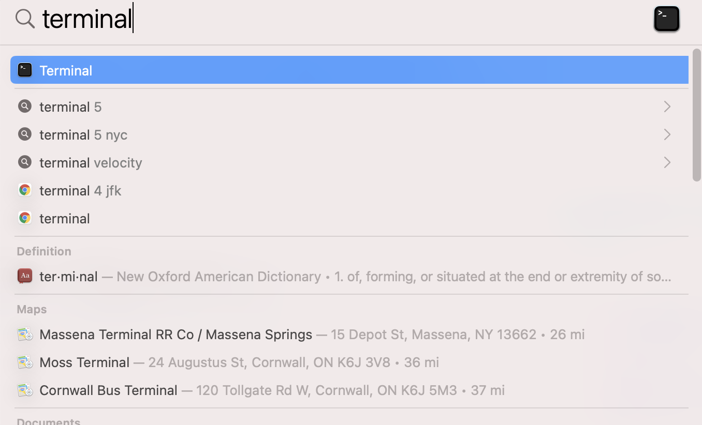
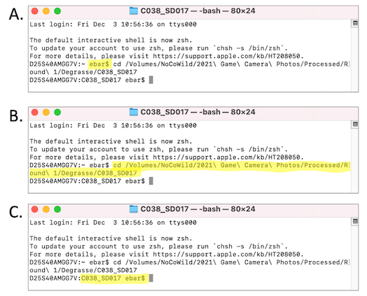

# Add copyright and read EXIF data from images to .csv via exifTool

Any time an image is made with a digital camera (including your phone camera, our game cameras, etc.), regardless of make, data are embedded in the image file. You never see these data unless you look for them. The embedded information is called "EXIF data" where EXIF stands for "exchangeable image file format" and it includes all of the metadata associated with an image, such as the exposure time, ISO, etc. Programs such as Adobe Lightroom can be used to view the exif data. How much exif data is collected depends on the camera and its features. For example, a camera with built in gps will encode the location where the photo was taken. If you're not into digital photography, you may not be aware that this information is stored with every digital image. 

We will need exif data to be able to assign images to proper events based on their time stamp. We will also add exif data to our images by adding copyright information. We will use a free tool called "ExifTool" to do so.

## Finding your way around the mac terminal (command line interface)
Use of ExifTool (and another tool called "ImageMagick" we will use in a later step) requires use of the command-line interface. On a mac, this interface is called the "terminal" and is also sometimes referred to as "bash." 

To access the terminal on a mac, you go to the search bar (the tool that looks like a magnifying glass) in the upper right of the screen and search "terminal" (fig 4.1). Once you see the terminal icon, click on it to open the terminal interface.

(ref:fig4-1) Using spotlight search on a mac to open the terminal interface.

```{r, echo = FALSE, fig4-1, fig.cap = '(ref:fig4-1)'}
#add figure 4.1 and caption

```
\ 
\ 


Table 4.1 shows a list of some of the common command-line functions.

  -----------------------------------------------------------------------
  Command        Purpose
  -------------- --------------------------------------------------------
  cd directory   changes path from working directory to named directory
                 where "directory" is the name of the directory you
                 wish to navigate to.

  cd ..          changes your directory to the parent directory from the
                 one you are currently in (note the space before the ..)

  ls             lists all visible files in your directory

  pwd            lists path of your current directory ("print working
                 directory")

  . vs ..        "." Specifies the directory you are currently in,
                 whereas ".." specifies the parent directory
  -----------------------------------------------------------------------

The terminal window presents a way to move around directories (folders)
on your computer, run software, and execute other commands without using
the "graphical user interface", or "GUI" that you are most familiar with
(the Menu-driven system where you click with your mouse to make things
happen). There are several different ways in which we must use the
terminal for image processing.

### Note about directory names

The command-line has trouble understanding folder names if there is a
space in the folder name. For example, if I have a folder called `Card 4`, I specify it by writing `Card\ 4`

The `\` tells the computer that the name is continuing. The space
followed by the 4 tells it that these are the remaining parts of the
directory name.

Avoid problems with the terminal by using `\` or not otherwise including spaces in filenames.

Also, this guide is written assuming you are using the iMac in the
Barthelmess research lab. If you are trying to use these commands on
another mac, there may be slight differences. If you are trying to use
these commands on a PC, you will find that the PC operating system uses
different characters to indicate a file path. Thus, this code will get
you on the right path on a PC, but will not be sufficient as is.

A neat trick for changing the directory folder path is to drop the folder icon (not from the terminal) onto the `\$` prompt inside of the terminal. The terminal
will then indicate the full path to that directory. Try this:

`cd \[drop folder with files here after you type cd\]`

Terminal will change the working directory to the correct file path!

## Using ExifTool
### Running ExifTool via the terminal.
Running ExifTool is fairly straightforward, as long as you don't get too
bogged down in command-line commands, which can be confusing. To start
ExifTool, type "exiftool" after the prompt on the command line. If the
computer tells you that ExifTool does not exist, see **Appendix 1. Additional Details and code snippets**, for instructions on how to install ExifTool.

-   If ExifTool is installed, the manual (called the "man" or "manpage"
    in command line talk) window will open orienting you to features of
    the program. To get out of that window and back to the command-line,
    type "Q".

-   Scroll through manpage using scroll bar

-   Exit the man by typing q and return.

### Viewing exif data on a single image

In the terminal, change to the directory that contains the files you
want information from. You can easily do this by first typing `cd ` after the terminal prompt and then dragging the folder icon from the folder on the NoCoWild hard drive that you wish to move to onto the terminal prompt (fig. 4.2).

(ref:fig4-2) Changing directories and modifying exif data using the terminal interface. **A** shows in yellow the root directory terminal prompt. **B** shows in yellow the text that is automatically added after `cd  ` when you drop a folder icon onto the terminal window following the `cd ` text.  **C** shows in yellow the new terminal prompt, reflecting the directory in which the computer is working. 

```{r, echo = FALSE, fig4-2, fig.cap = '(ref:fig4-2)'}
#add figure 4.2 and caption

```


Note the name of an image in the directory.

Then, in the terminal at the command-line prompt (usually a `\$ ` or `\>`),
type

`exiftool imagename.jpg`

where imagename.jpg is the name of the file you want data from. The
computer will then display the information you seek. An example of
output is in Figure 12 below.

**Figure 13. Example output from viewing exif data from a single image with exiftool.**

You will use this method to ensure that copyright information is
properly added.

### Using ExifTool to add copyright information to the images.

To add copyright information to the images, make sure you are in the
folder that contains the images you wish to add copyright information,
and type the following at the command-line:

```
$ exiftool -overwrite_original -rights="Copyright" -CopyrightNotice="Bart Lab and Nature Up North" *.JPG

 (put this all on one line)
```

This basically says to the computer: "Open exiftool, and overwrite new
information into the original metadata. Add a field called 'Copyright'
and fill the field with "Bart Lab and Nature Up North". Do this for all
of the files in the folder."

Once you have run this code, examine the exif data for a few of the
images in the folder using the method described for viewing exif data for a single image above and make sure the copyright information is present.

## Summary
At the end of the copyright addition step, each folder of images will have the appropriate copyright information embedded into the image exif data using ExifTool. We take this step so that if anyone downloads one of our images from the zooniverse and tries to use it commercially, we have evidence that the image is ours.
