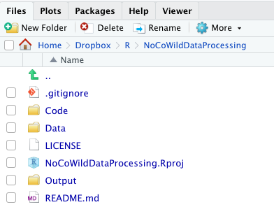
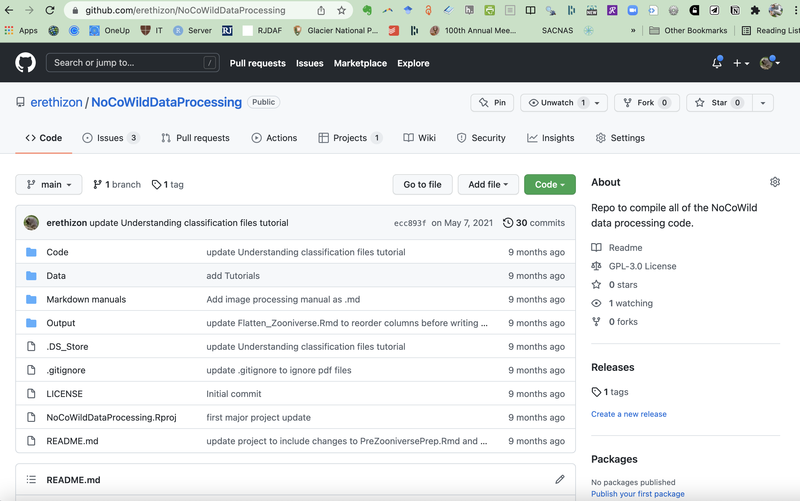

# Familiarize yourself with NoCoWildDataProcessing RStudio project

## Overview
Let's take a step back and think about our workflow. At this point, we have organized all of our image files on the hard drive, creating both the *raw* and *processed* folders of images.  We have renamed images to reflect the metadata we wish to tie them to, have added copyright information and resized the images for upload to zooniverse. If necessary, we also repaired any problems with Dates and Times in the image exif data. We've generated a .csv file that has, for each image, the important bits of exifdata stored in the .csv file.

Before we can push the images to the Zooniverse platform for ID, we need to create what the Zooniverse folks call the *manifest file*, a .csv that is uploaded alongside the images that contains important metadata about them that the Zooniverse interprets.

We set our game cameras to take a burst of up to three images each time
the camera is triggered. We call each set of 3 images a single
*event.* However, our folder of images is just a set of files. We need
a way to assign each image to the proper camera trap event. We have R
code that we use to do just that.

## Organization of our project in RStudio
We have a RStudio project called *NoCoWildDataProcessing* that we use for preparing the Zooniverse manifest file.

To assign images to the proper event, you will need to know the location
(file path) to the folder containing the images (and only the images, no
other files can be in the folder) and the location of the exif metadata
file for that folder that was created in Section 6 above. 


We use a special structure (Figure 7.1) to keep this project running
smoothly when being used by many different people.

(ref:fig7-1) Organization of the NoCoWildDataProcessing project in RStudio.

```{r, echo = FALSE, fig7-1, fig.cap = '(ref:fig7-1)'}
#add figure 1 and a text reference as its caption
 #figure
```


### Code

The `Code` folder is where we keep all of the .Rmd files and .R files
for actually running processes in RStudio. The Code folder contains
three subfolders: `PreZooniverse`, `PostZooniverse`, and
`Functions.` In this manual, we will only make use of the
PreZooniverse and Functions subfolders.

PreZooniverse contains two subfolders: *Explanatory Rmd files* and
*Code to Run*. You will be using the .Rmd file called
*PreZooniverse.Rmd* located in the *Code to Run* folder.

PreZooniverse.Rmd relies on several custom functions located in the
Functions folder. You will not need to look inside of the Functions
folder, but it must be in place and must contain the correct .R files in
order for the scripts in PreZooniverse.Rmd to run properly.

The files in the Explanatory Rmd files folder provide more detailed
descriptions of the steps involved in developing the functions we use in
our project.

### Data

The Data folder is where we keep only **source data files**. These are
files that R will suck in for processing, but that will **never**[^3] be
edited or saved over in order to ensure reproducibility.

### Output

The Output folder is where we save the outputs of the code (as opposed
to source files used to produce the analysis). This is where we save all
kinds of outputs including data files and plots. The Output folder is
arranged into various subfolders. The key Output subfolders for the
purposes of this manual are in the PreZooniverse subfolder and are
called ImagesByEvent and Manifests.

## Accessing the project from Github

Github is a version control system used by people who code. We use
Github because it allows folks to simultaneously work on the project and
it **protects** us against unwanted changes (we can roll back the code
to any prior state). However, using github within RStudio, though pretty
straightforward, can be a bit confusing at first.

All of the R code you need to process the file is in the RStudio project
called **NoCoWildDataProcessing.** It is available for [access on github](https://github.com/erethizon/NoCoWildDataProcessing) (fig 7.2):

(ref:fig7-2) The NoCoWildDataProcessing project repository on GitHub

```{r, echo = FALSE, fig7-2, fig.cap = '(ref:fig7-2)'}
#add figure 2 and a text reference as its caption
 #figure
```


**Please work with Erika to make sure you are accessing
the GitHub project correctly so as to allow different folks to work on the
project at the same time.**

## Summary

[^3]:Never ever ever!
