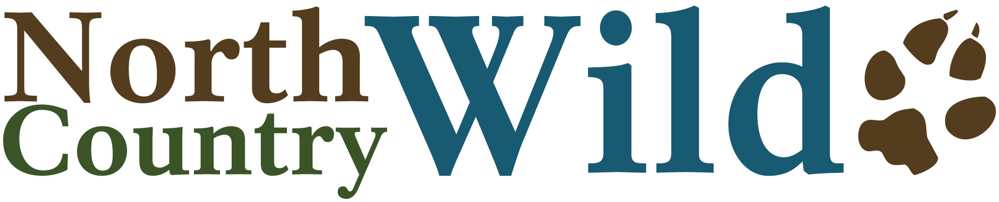

--- 
title: "North Country Wild Image Processing and Uploading Handbook"
author: "Erika L. Barthelmess"
date: "`r Sys.Date()`"
site: bookdown::bookdown_site
output:
  bookdown::html_document2 #specify output for making fig refs
---

# Preface {-}
```{r, echo = FALSE, NoCoLogo}
#add NoCoWild logo 
 #figure

```
This book is designed to guide students in the Barthelmess research lab, affectionally known as the *SLU Mammal Crew*, through the steps required to process game camera images for upload to the [zooniverse platform](https://www.zooniverse.org/projects/barthelmess/north-country-wild). It is meant as a follow along guide that lives on the web.

